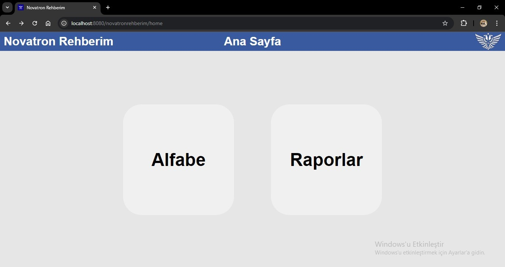
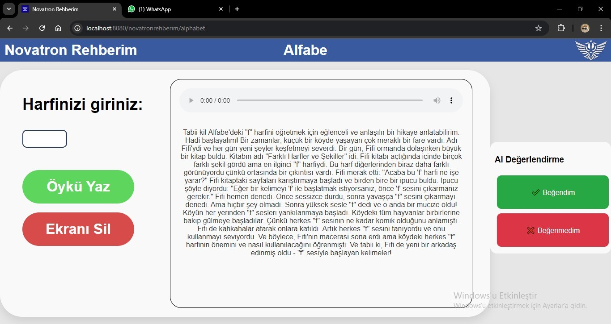
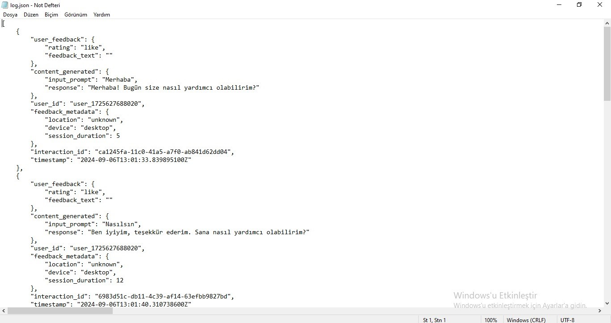

*Bu proje TEKNOFEST 2024 Antalya T3AI Hackathon Yarışması Uygulama Geliştirme Kategorisi için geliştirilmiştir.*

# Novatron Rehberim
## Çocukların okuma becerilerini kalıcı ve işitsel olarak geliştirmesi için sunulan bir sesli öykü okuma platformu.

## Novatron Programmers: 2322074
- 👤 Üye 1:  [Ulus Ata ASLAN](https://www.github.com/ulusata)

- 👤 Üye 2: [Yiğit Rıdvan GÜLER](https://www.github.com/yigitrglr)

- 👤 Üye 3: [Ömer Mehmet Özdemir](https://www.github.com/Aerodynamiks)


## Uygulamadan Ekran Görüntüleri








## Uygulamayı Lokalde Çalıştırma

### Apache Tomcat Kurma
[Sayfasını](https://tomcat.apache.org/download-90.cgi) ziyaret ederek Apache Tomcat'in son sürümünü indiriniz.
Ardından uygun klasöre yerleştirdikten sonra enviromental variable olarak tomcat klasörünü eklemeniz gerekmekte. Enviromental variable adı CATALINA_HOME olarak kaydediniz.

### Maven Kurma
[Sayfasını](https://maven.apache.org/download.cgi) sayfasından 3.9.9 sürümüne sahip Apache Maven zip dosyasını indiriniz.
Ardından enviromental variable olarak kaydetmek için MAVEN_HOME değişken ismini kullanınız.

### JDK Kurma
[Sayfasını](https://adoptium.net/) ziyaret ederek son sürüm JDK'yı indiriniz ve kurunuz.

### Projeyi Build Etme
Projenin build edilmiş(.war) dosyası zaten bu repo'da bulunmaktadır. Tekrar build etmek isterseniz ana uygulama dizinine gelip konsol üzerinnden ```` mvn tomcat7:deploy ```` komudunu kullanmanız gerekir. Tüm testler gerçekleştikten sonra uygulama build edilir.

### Tomcat Sunucusunu Ayağa Kaldırma
Build edilen war dosyası Tomcat dizininde webapps'ta bulunur.
Fakat biz yine de uygulamanın son sürümünü build edip repository ana dizinine novatronrehberim.war olarak ekledik. Onu alıp Tomcat ana klasörü içinde bulunan webapps'e ekleyebilirsiniz. Eğer kendiniz build ettiyseniz ana dizinde bulunan /bin klasörüne giriniz ve Windows kullanıyorsanız startup.bat dosyasını yönetici olarak çalıştırınız. Kapatmak içinse aynı dizinde bulunan shutdown.bat dosyasını çalıştırınız. Son olarak Opera veya Chrome tarayıcıları üzerinden localhost:8080 yerel hostunu açınız.

### Endpointler
* novatronrehberim/home : Ana sayfa
* novatronrehberim/alphabet : Öykü oluşturma sayfası


